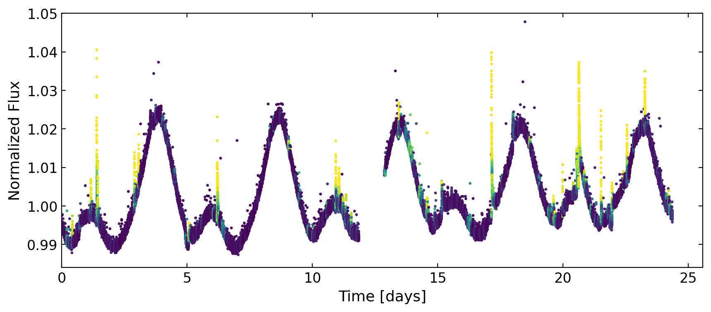
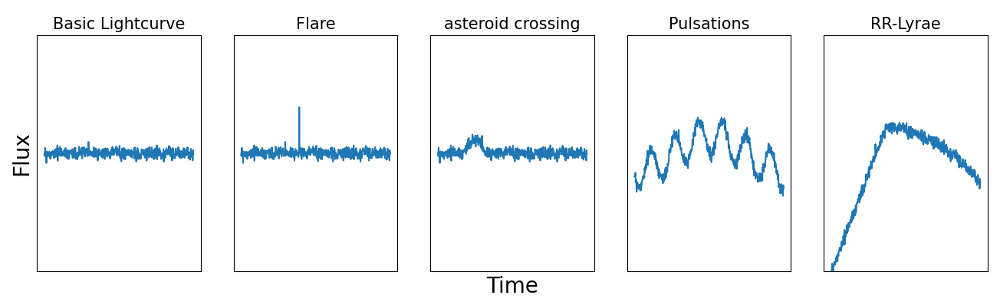

**flarenet** is a **convolutional neural network** used to **predict flares** in 20-second cadence light curves from NASA's Transiting Exoplanet Survey Satellite (**TESS**).

With a single line of code, you can generate flare predictions for any TESS 20-s target.

<div align="center">
  
</div>

### Installation
With pip:
```bash
pip install flarenet20
```

For developers:
```bash
git clone https://github.com/veraberger/flarenet.git
cd flarenet
pip install .
```

### Model
The default model has been trained on ~1000 TESS light curves with injected flares and common sources of false-positive variability (see figure below).
<div align="center">
  
</div>

**model performance**

### Usage
Tutorial notebook: [docs/example.ipynb](docs/example.ipynb)

Use our model trained on real TESS light curves with injected false-positive variability signatures, or train your own with the ```Flarenet``` class.

The model outputs likelihoods only - choose your own confidence threshold for flares.

If you use this code in publications, please cite Berger, Schanche, et al. (2025).

MIT License
